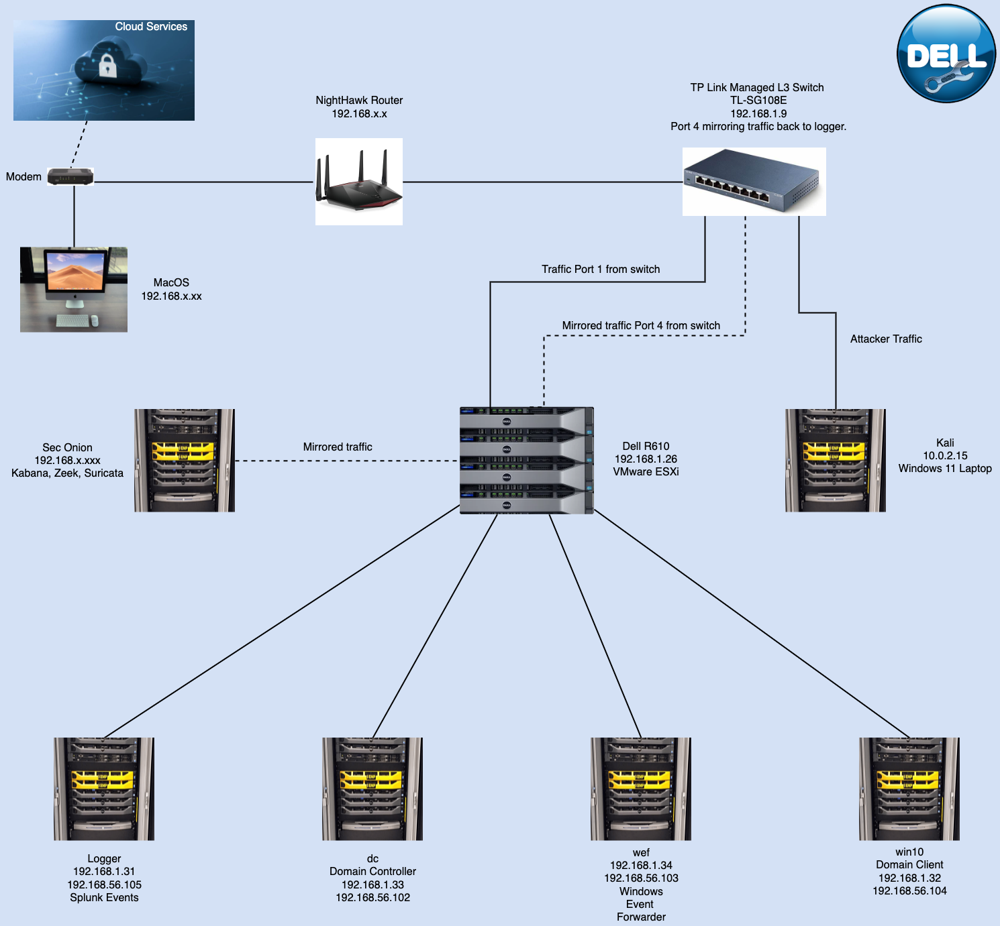

# Server-Lab

This is my Server Lab, I'm using a Dell R610 Server running ESXi VMware loaded with Detectionlab and using Splunk and Security Onion to monitor network traffic and logs. 
In the topology below you can see the actual equipment and design of my lab. Im mirror porting traffic and data to Security Onion to monitor.
Using my Kali Linux VM via a Windows workstation to create power-shell scripts to create log files. 

 
 

